---------------------------------------------------------------

# Application Classiflex

### Équipe 

    équipe I5 :
- Arthur Goddefroy
- Cristobal Pinto
- Antoine Lencel
- Mathieu Poumaere   
- Florian Gambirasio

---
### Organisation du travail

    Nous avons décidé qu'Arthur Goddefroy s'occuperait principalement du JavaFX et donc qu'il ferait la majorité de la partie IHM, il a donc réalisé les prototypes.
    Ensuite Antoine Lencel a réalisé la version final et remise au propre du diagramme de classe après que nous l'ayons validé avec M.Nongaillard, puis il a réalisé l'UML.
    Cristobal Pinto s'est occupé de la restructuration des fichiers et dossiers, aider à gérer les conflits git, faire du code et de l'IHM et aider notament pour la fiche descriptive du chargement des données.
    Pour sa part Florian Gambirasio a codé la base de la partie orienté objet de l'application et réalisé une partie des tests et la javadoc.
    Enfin Mathieu Poumaere s'est occupé de faire la version final du diagramme de cas d'utilisation, réaliser et modifier les fiches descripitves et une partie du compte rendu d'analyse.
    Nous avons réalisé tous ensemble les premières version du diagramme de cas d'utilisation et du diagramme de classe.

---

## Diagramme de cas d'utilisation

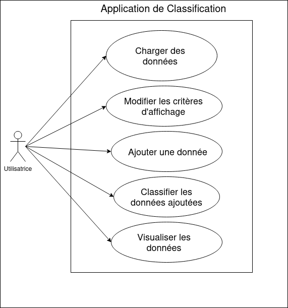

---
### Fiches descriptives

*Inclure les fiches descriptives pour ces fonctionnalités:*

- ***Charger l'ensemble de données***

Nom du Système : Application de classification

Cas d'utilisation : Charger les données depuis un fichier csv

Acteur principal : L'utilisatrice

Déclencheur : -------

Acteurs secondaires : Système

Précondition : Il y a au moins un fichier csv disponible et valide

Garantie en cas de succès : Les données du/des fichier(s) csv sont chargés dans l'application

Garantie minimales : Rien ne change

Scénario nominal :
1. L'utilisatrice sélectionne le bouton "import data" pour charger les données.
2. Le système parcours les fichiers puis affiche les fichiers a partir de l'emplacement de l'application.
3. L'utilisatrice sélectionne le jeu de données qu'elle souhaite ajouter à l'application.
4. Le système charge les données, ensuite il affiche un message de succès

Scénario(s) Alternatif(s) :
	Aucun

- ***Ajouter une donnée***

Nom du Système : Application de Classification

Cas d'utilisation : Ajouter des données (ajouter un point dont on ne connait pas la classification)

Acteur principal : Utilisatrice

Déclencheur : -------

Acteurs secondaires : Système

Précondition : Avoir chargé des données csv.

Garantie en cas de succès : Le point est ajouté et s'affiche sur le nuage de Points 

Garantie minimales : Le point n'est pas enregistré

Scénario nominal :
1. L'Utilisatrice sélectionne le bouton "Ajouter un Point". (Ecran A1)
2. Le Système affiche un formulaire avec en titre le fichier csv actuellement sélectionné et des données à saisir celles des attributs du fichier (Ecran A2)
3. L'Utilisatrice remplit le formulaire affiché et valide. (Ecran A3)
4. Le Système vérifie que les données sont au bon format puis affiche le point ajouté dans le nuage de points. (Ecran A4)

Scénario(s) Alternatif(s) :
	Aucun

- ***Classifier la donnée non classifiée***

Nom du Système : Application de classification (ClassiFlex)

Cas d'utilisation : Classifier les données

Acteur principal : L'utilisatrice

Déclencheur : --------

Acteurs secondaires : Système

Précondition : l'utilisatrice à ajouté des données

Garantie en cas de succès : Le point est classifié

Garanties minimales : Rien ne change

Scénario nominal :
1. L'utilisatrice sélectionne le bouton "Classifier". (Ecran B1)
2. Le système affiche un formulaire.(Ecran B2)
3. L'utilisatrice saisit la valeur de K et le protocole qu'elle veut pour séléctionner les plus proches voisins.(Ecran B3)
4. Le système attribue une classe en fonction du protocole choisi. Puis renvoie une fenêtre affichant les points qui n'étaient pas classifiés ainsi que la classe la plus probable. (Ecran B4)

Scénario(s) Alternatif(s) :
	Aucun

---

### Prototypes pour l'interface

- *Ajouter une donnée*

**Ecran A1**

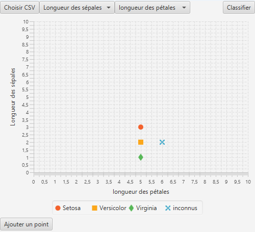

**Ecran A2**

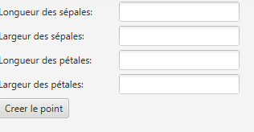

**Ecran A3**

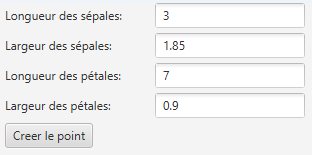

**Ecran A4**

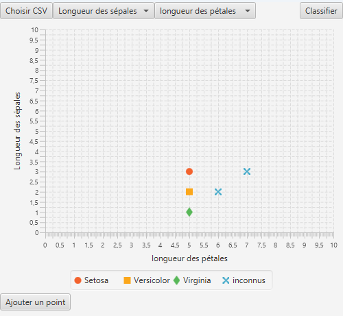

- *Classifier la donnée non classifiée*

**Ecran B1**

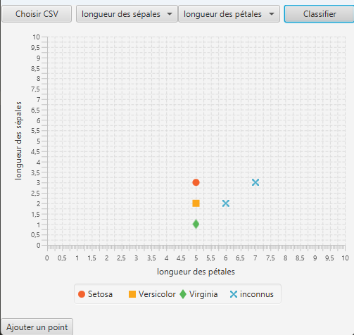

**Ecran B2**

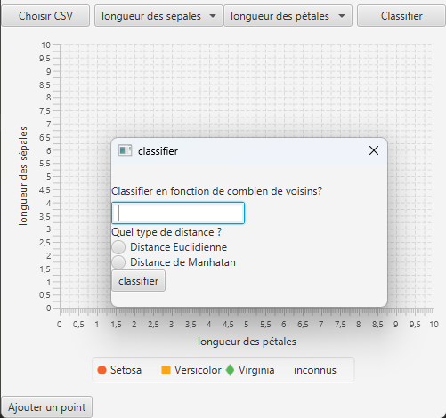

**Ecran B3**

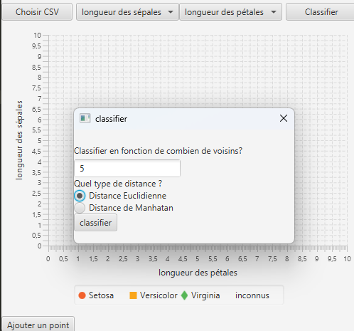

**Ecran B4**

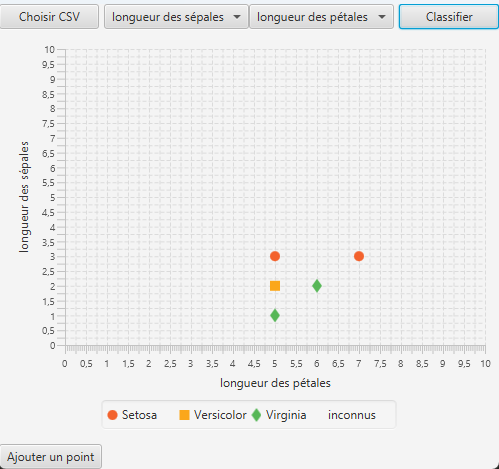

- *Modifier les attributs pour l'affichage*

**Ecran C1**

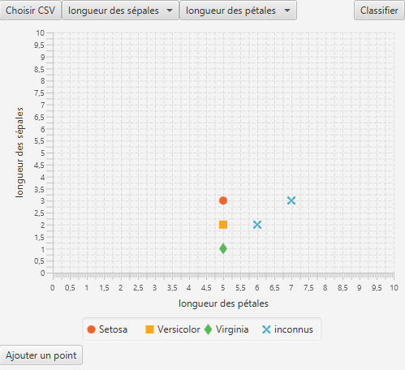

**Ecran C2**

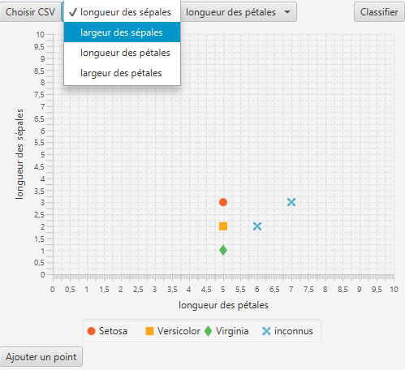

**Ecran C3**

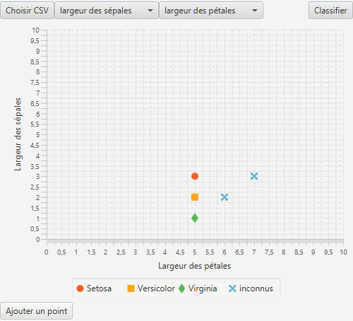

---

## Diagramme de classes

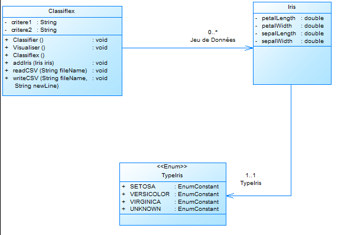

